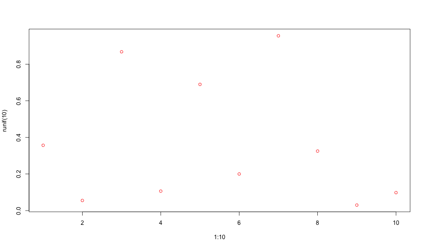

Well, does this work? Let's test some output:

``` r
runif(100)
```

    ##   [1] 0.320126065 0.885037118 0.657482244 0.032146122 0.962260793
    ##   [6] 0.291204990 0.826502275 0.954125540 0.365885933 0.319673656
    ##  [11] 0.372918932 0.226234714 0.468423421 0.818812431 0.953975531
    ##  [16] 0.946196960 0.191850106 0.732675800 0.340579823 0.086238248
    ##  [21] 0.482979032 0.910855740 0.040426825 0.823331751 0.230870527
    ##  [26] 0.770601405 0.292202970 0.345354311 0.791422865 0.782013765
    ##  [31] 0.221657989 0.421715951 0.771216484 0.553992009 0.754995310
    ##  [36] 0.998100394 0.148164263 0.962211860 0.186776956 0.966224491
    ##  [41] 0.230796951 0.634054832 0.329294202 0.201333268 0.908665390
    ##  [46] 0.007158082 0.877943409 0.552557607 0.050133649 0.295661679
    ##  [51] 0.601552271 0.147186095 0.715521925 0.352695488 0.909284635
    ##  [56] 0.667543043 0.310247933 0.265271009 0.949132821 0.552394980
    ##  [61] 0.491193233 0.656389973 0.013871743 0.336724058 0.360644473
    ##  [66] 0.474868009 0.276730492 0.077667074 0.404913420 0.030098191
    ##  [71] 0.426328412 0.561433397 0.459641448 0.317651628 0.963937315
    ##  [76] 0.607435886 0.846530056 0.677975115 0.998303519 0.629155615
    ##  [81] 0.235624403 0.047263243 0.489984555 0.110822520 0.175732428
    ##  [86] 0.866884235 0.703941134 0.954749279 0.634274856 0.695531355
    ##  [91] 0.580897693 0.869716201 0.924638970 0.203100138 0.654048196
    ##  [96] 0.878070486 0.089278802 0.705901718 0.732025623 0.915048403

How about plots?

``` r
plot(1:10, runif(10), col = "orange")
```


